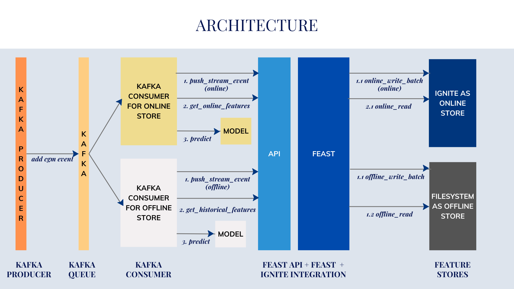

# Ignite feast cgm demo
 A project that works with CGM data and utilizes it to predict glucose levels using Ignite, Feast and Kafka


## Table of Contents

1. [Features](#features)
2. [Architecture & Project Structure](#architecture--project-structure)
3. [Running the Project](#running-the-project)
   - [Run in Local Environment (Standalone)](#run-in-local-environment-standalone)
   - [Run via Docker](#run-via-docker)
   - [Run on AWS](#run-on-aws)
4. [API Documentation](#api-documentation)
5. [Components Used](#components-used)


## Features

### Feast-Ignite Integration for Real-Time Feature Serving

* **Ignite based Online Store:** Leverages Ignite's in-memory database to provide online features for real-time model predictions.
* **Feature Management:**  Feast manages feature definitions, versioning, and the synchronization between online and offline stores.

### Glucose Prediction Model

* **Personalized Prediction:**  Predicts glucose levels based on individual subject data, day of the week, and time.
* **Example Model Included:**  Includes a pre-trained `glucose_prediction_model-v1` for demonstration and experimentation.

### Offline Feature Store with Parquet Storage

* **Historical Data:** Stores historical CGM data in a Parquet file (`cgm-stats.parquet`) for offline feature engineering and model training.

### Feature Repository

* **Feature Definitions:** The `repo.py` file defines all entities (subjects), feature views (calculations on raw data), and their relationships.

### FastAPI-based API

* **Rest API:** Provides a straightforward API endpoint to run the entire workflow from apply to teardown.

## Architecture & Project Structure



This project consists of the following key files and components:

1. **FastAPI API (`api.py`):** Provides a RESTful API (built with FastAPI) to retrieve features from the online store.
  1.1. **Configuration File (`feature_store.yaml`):** Central configuration file for Feast, specifying the feature store name, project name, and other settings. There are three versions of it, one for each type of deployment; local, docker, and aws
  1.2. **Feature Repository (`repo.py`):** Defines the Feast entities (e.g., patients), feature views (calculations on raw data), and their relationships. This is the central configuration for the feature store. There are three versions of it, one for each type of deployment; local, docker, and aws
2. **Example Model (`glucose_prediction_model-v1`):** A pre-trained model (likely serialized using pickle or joblib) for glucose level prediction.
3. **Historical Data (`cgm-stats.parquet`):** Parquet file containing sample CGM data used for feature engineering and model training.
4. **Kafka Producer (`kafka_producer.py`):** Reads CGM data from a Parquet file, modifies timestamps, sends messages to Kafka, and broadcasts events to WebSocket clients.
5. **Kafka Consumer (`kafka_consumer.py`):** Consumes messages from Kafka, pushes to Feast, fetches from Feast, uses a model to predict the excepected glucose level and broadcasts to WebSockets.
6. **Model Builder (`model.py`):** Trains a multiple linear regression model to predict glucose levels and saves the trained model to a specified file path.


## Running the Project

This project supports three environments: local, Docker, and AWS. The configuration for each environment is stored in separate files.

### Configuration Files

- **Feature Store**: Under the `api/repo` folder, you'll find `feature_store.yaml` files for each environment:
  - `local/feature_store.yaml`
  - `docker/feature_store.yaml`
  - `aws/feature_store.yaml`

- **Kafka Producer and Consumer**: Configuration files are located in the `config` folder of each component:
  - `local_config.json`
  - `docker_config.json`
  - `aws_config.json`

- **Dockerfiles**: Dockerfiles are located in the folder of each component, API, Producer and Consumer:
  - For each, the environment is selected using the `--env` parameter in the Dockerfile, example:
    ```dockerfile
    CMD ["python", "src/kafka_consumer.py", "--env", "local"]  # or "docker" or "aws"
    ```

### Run in Local Environment (Standalone)

#### Prerequisites

1. Python 3.11.7
    * You can use `pyenv` to manage multiple Python versions (optional):
        1. Install `pyenv`: `brew install pyenv` (or your system's package manager)
        2. Create and activate the environment: 
            ```bash
            pyenv virtualenv 3.11.7 feast-latest
            source $HOME/.pyenv/versions/feast-latest/bin/activate 
            ```
    * Alternatively, ensure Python 3.11.7 is installed directly.

2. Clone this repository:

   ```bash
   git clone https://github.com/GridGain-Demos/ignite_feast_cgm_demo.git
   cd ignite_feast_cgm_demo
   ```

3. Install project dependencies using pip:
    ```bash
    pip install feast-gridgain==1.0.0 feast==0.38.0 pandas==2.2.2 numpy==1.26.4 scikit-learn==1.5.0 joblib==1.4.2 fastapi==0.111.0 pydantic==2.7.4 uvicorn==0.30.1 aiokafka==0.10.0 kafka-python==2.0.2 pygridgain==1.4.0 pyignite==0.6.1 websockets==12.0 pyarrow==16.1.0 requests==2.32.3
    ```

#### Configuration

For local development, the `feature_store.yaml` should look like this:

```yaml
project: cgm_ignite_feast_kafka
registry: data/registry.db
provider: local
online_store:
    type: feast_gridgain.ignite_online_store.IgniteOnlineStore
    host: localhost
    port: 10800
entity_key_serialization_version: 2
```

1. **Start FastAPI Server:**
    - Run `uvicorn api:app --reload` to start the FastAPI server for REST API access.
      ```bash
      cd api/src
      uvicorn api:app --reload
      ```
   - Access the Swagger UI at `http://localhost:8000/docs` to explore and test the API endpoints.
    
   

2. **Test Kafka Integration:**

   - **Kafka Setup**
      - Ensure your Kafka broker is running.
      - Create the `cgm_readings` topic in Kafka.
      - If auto.create.topics.enable=true, it is automatically created. Most typical setups have this.
   
   - **Start Components**

      - **Start Kafka Producer:**: This begins sending CGM events to Kafka and broadcasting them via WebSocket.
        ```bash
        cd kafka_producer
        python src/kafka_producer.py
        ```
      

      - **Start Kafka Consumer:**: This starts consuming events from Kafka, pushing data to Feast Online Store, reading from feast, and then predicting based on a model.
        ```bash
        cd kafka_consumer
        python src/kafka_consumer.py
        ```
      
      - **Start Kafka Consumer for Historical Data:**: This starts consuming events from Kafka, pushing data to Feast Offline Store, reading from feast, and then predicting based on a model.
        ```bash
        cd kafka_consumer
        python src/kafka_consumer.py --store offline
        ```
     

4. **Test Model Creation:**
    -   Run `python model.py` to create the model in the model folder
   You can change the name of the input parquet and the output model file within model.py
        ```bash
            cd kafka_consumer/src
            python model.py
        ```
   

## Run via Docker

#### Prerequisites
The entire environment is configured within the Dockerfiles, so no installation is required here.

#### Configuration

For Docker environment, use the`feature_store.yaml`:

```yaml
project: cgm_ignite_feast_kafka
registry: data/registry.db
provider: local
online_store:
    type: feast_gridgain.ignite_online_store.IgniteOnlineStore
    host: ignite
    port: 10800
entity_key_serialization_version: 2
```

Before starting the docker containers, create a network called cgm_network:

```bash
docker network create cgm_network
```

1. **Start the Kafka Container:**
    ```bash
    cd kafka
    docker-compose -p cgm_network up
    ```

2. **Start the Ignite Container:**
    ```bash
    cd ignite
    docker-compose -p cgm_network up
    ```

3. **Start the API Container:**
    ```bash
    cd api
    docker-compose -p cgm_network up
    ```

4. **Start the Kafka Producer:**
    - In the file Dockerfile.producer, ensure the ***--env*** is set to docker

      ```
      CMD ["sh", "-c", "echo 'Starting producer script' && python kafka_producer.py --parquet-file-path data/cgm_stats.parquet --env docker --kafka-topic cgm_readings"]
      ```
    - Then run the producer, that will read data from the parquet file and push it to the kafka topic
      ```bash
      cd kafka_producer
      docker-compose -p cgm_network up
      ```

5. **Start the Kafka Consumer:**
    - In the file Dockerfile.consumer,
      - ensure the ***--env*** is set to docker
      - ensure the ***--base-url*** is set to the url of the api container from point (3), It is typically http://cgm_network-feast_api-1:8000

      ```bash
      CMD ["sh", "-c", "echo 'Starting consumer script' && python kafka_consumer.py --store online --base-url http://cgm_network-feast_api-1:8000 --id-field subject_id --feature-service cgm_activity_v3 --env docker --kafka-topic cgm_readings --model-filepath model/glucose_prediction_model-v1.pkl"]
      ```
    - Then run the consumer, that will feed the data to the offline store
      ```bash
      cd kafka_consumer
      docker-compose -p cgm_network up
      ```

6. **Start the Kafka Consumer for Offline Stores:**
    - In the file Dockerfile.historicalconsumer,
      - ensure the ***--env*** is set to docker
      - ensure the ***--base-url*** is set to the url of the api container from point (3), It is typically http://cgm_network-feast_api-1:8000

      ```bash
      CMD ["sh", "-c", "echo 'Starting consumer script' && python kafka_consumer.py --store offline --base-url http://cgm_network-feast_api-1:8000 --id-field subject_id --feature-service cgm_activity_v3 --env docker --kafka-topic cgm_readings --model-filepath model/glucose_prediction_model-v1.pkl"]
      ```
    - Then run the historical consumer, that will feed the data to the offline store

      ```bash
      cd kafka_consumer
      docker compose -p cgm_network -f docker-compose-historical.yml up
      ```
  
#### Run on AWS

***Please note this requires significant amount of setup on AWS.***

For AWS deployments, we use ***Snowflake as the offline database*** and ***Confluent for Kafka*** and ***Nebula for GridGain***. 
So, we need accounts setup for Confluent, GridGain and Snowflake

#### Prerequisites

##### Create accounts for Confluent, GridGain and Snowflake

Go the relavant sites and create the accounts.
1. In Confluent, create a topic cgm_readings
2. In Snowflake create a warehouse: FEASTTEST, database: FEASTTEST, schema: PUBLIC.
  - Then create a table in snowflake:
    ```
    create or replace TABLE FEASTTEST.PUBLIC."cgm_hourly_stats" (
      "event_timestamp" TIMESTAMP_NTZ(9),
      "subject_id" INT,
      "glucose" INT,
      "created" TIMESTAMP_NTZ(9)
    );
    ```

#### Configuration

**Configure API:**

1. Go to api/repo/aws
2. Open the file feature_store.yaml and change the urls, username, password, etc as per your Snowflake & GridGain accounts account

    ```yaml
    project: cgm_ignite_feast_kafka
    registry: data/registry.db
    provider: local
    offline_store:
        type: snowflake.offline
        account: your_snowflake_account
        user: your_username
        password: your_password
        role: ACCOUNTADMIN
        warehouse: FEASTTEST
        database: FEASTTEST
    batch_engine:
        type: snowflake.engine
        account: your_snowflake_account
        user: your_username
        password: your_password
        role: ACCOUNTADMIN
        warehouse: FEASTTEST
        database: FEASTTEST
    online_store:
        type: feast_gridgain.gridgain_online_store.GridGainOnlineStore
        username: your_gridgain_username
        password: your_gridgain_password
        url: your_gridgain_url
        port: 10800
    entity_key_serialization_version: 2
    ```

**Configure Kafka Producer:**
1. Go to kafka_producer/config
2. Open the file aws_config and change the content to the connection settings (client.properties) given to you by confluent
3. Open the file ***Dockerfile.producer*** and update the following:
    - Update the ***--base-url*** to your own URL for the api, once it is deployed on aws
    - Ensure the ***--env*** is set to aws

    ```
    CMD ["sh", "-c", "echo 'Starting consumer script' && python kafka_consumer.py --store offline --base-url http://api.cgm-env.cgm-ignite-feast-kafka.local:8000 --id-field subject_id --feature-service cgm_activity_v3 --env aws --kafka-topic cgm_readings --model-filepath model/glucose_prediction_model-v1.pkl"]
    ```

**Configure Kafka Consumers:**
1. Go to kafka_consumer/config
2. Open the file aws_config and change the content to the connection settings (client.properties) given to you by confluent
3. Open the file ***Dockerfile.consumer*** and update the following:
    - Update the ***--base-url*** to your own URL for the api, once it is deployed on aws
    - Ensure the --env is set to aws

    ```
    CMD ["sh", "-c", "echo 'Starting consumer script' && python kafka_consumer.py --store online --base-url http://api.cgm-env.cgm-ignite-feast-kafka.local:8000 --id-field subject_id --feature-service cgm_activity_v3 --env aws --kafka-topic cgm_readings --model-filepath model/glucose_prediction_model-v1.pkl"]
    ```

4. Open the file ***Dockerfile.historicalconsumer*** and update the following:
    - Update the ***--base-url*** to your own URL for the api, once it is deployed on aws
    - Ensure the ***--env*** is set to docker

    ```
    CMD ["sh", "-c", "echo 'Starting consumer script' && python kafka_consumer.py --store offline --base-url http://api.cgm-env.cgm-ignite-feast-kafka.local:8000 --id-field subject_id --feature-service cgm_activity_v3 --env aws --kafka-topic cgm_readings --model-filepath model/glucose_prediction_model-v1.pkl"]
    ```

**Configure buidspec.yaml:**

Under pre-build : In the first line aws ecr get-login-password change --password-stdin to your account link
Also change ***IMAGE_REPO_NAME***


#### Install aws cli and aws copilot

**A. Install AWS CLI:**
https://docs.aws.amazon.com/cli/latest/userguide/getting-started-install.html

***Setting Up AWS CLI for Copilot Deployment**

To deploy your application using Copilot, you need the AWS CLI installed and configured with appropriate credentials. Follow these steps to get started:

**B. Create IAM Users and Configure Profiles**

For security best practices, create two separate IAM (Identity and Access Management) users:

1.  Power User (for initial setup)
    1.  **AWS Management Console:** Log into the AWS Management Console using your root credentials.
    2.  **IAM:** Navigate to the IAM service.
    3.  **Add User:** Click "Users" -> "Add users."
    4.  **User Details:**
        -   **User name:** Enter a name like "poweruser."
        -   **Access type:** Select "Programmatic access."
    6.  **Permissions:** Attach the "AdministratorAccess" policy.
    7.  **Tags:** (Optional) Add tags for organization.
    8.  **Review:** Review details and click "Create user."
    9.  **Save Credentials:** Securely store the **Access Key ID** and **Secret Access Key**.


2.  Deployment User (for deployment and management)
Repeat the same steps for deployuser but with the following permissions
    1.  **AmazonECS_FullAccess:** Allows full access to Amazon ECS resources.
    2.  **AmazonECRReadOnlyAccess:** Allows read-only access to Amazon ECR repositories.
    3.  **AmazonS3FullAccess:** Allows full access to Amazon S3 buckets (you can later refine this to restrict access to specific buckets if needed).
    4.  **AWSCloudFormationFullAccess:** Allows full access to AWS CloudFormation.
    5.  **AWSCodeBuildDeveloperAccess:** Allows access to CodeBuild for building and deploying applications (consider `AWSCodeBuildReadOnlyAccess` if you only need to view logs).
    6.  **AmazonSSMReadOnlyAccess:** Allows read-only access to AWS Systems Manager (SSM) Parameter Store.
    7.  **CloudWatchLogsFullAccess:** Allows full access to CloudWatch logs.


**B. Configure AWS CLI Profiles**

1.  **Configuring User Profiles**
  1. **Power User (poweruser):** Use this profile for initial setup and administrative tasks.
    1. **Open Terminal:**
    2. **Configure it with the Power User Profile:**
      -  Enter the **Access Key ID** and **Secret Access Key** for the "poweruser." Set your **default region** (e.g., us-east-1).

```bash
aws configure
```
  2. **Deployment User (deployuser):** Use this profile for deploying and managing services.
    1. **Open Terminal:**
    2. **Configure it with the Deployment User Profile Profile:**
      -  Enter the **Access Key ID** and **Secret Access Key** for the "deployuser." Set your **default region** (e.g., us-east-1).

```bash
aws configure --profile deployuser
```

**Install AWS Copilot:**

https://aws.github.io/copilot-cli/docs/getting-started/install/
brew install aws/tap/copilot-cli


#### Build, Deploy & Run the containers

1.  **Initialize the project & services:**
copilot init --profile power-user
    - Choose project as cgm_ignite_feast_kafka

2.  **Configure AWS CodeBuild:**

    1.  ***Navigate to CodeBuild:*** Open the AWS CodeBuild console.
    2.  ***Create Build Project:*** Click on "Create build project."
    3.  ***Configure Your Project:***
        -   ***Project Name:*** Enter a descriptive name, such as "cgm-ignite-feast-kafka-build".
        -   ***Source Provider:*** Select "GitHub" and enter the repository URL: <https://github.com/manini-zs/cgm_ignite_feast_kafka.git>
        -   ***Environment:***
            -   ***Provisioning model:*** Choose "On Demand"
            -   ***Environment image:*** Select "Managed image"
            -   ***Operating system:*** Select "EC2" (if required)
        -   ***Buildspec:*** Select "Use a buildspec file." The `buildspec.yml` file is already included in the codebase.
        -   ***Logs:*** (Optional) Select "CloudWatch logs" to store build logs.

3.  **Initialize services:**

    1.  **Initialize the API service**

    ```bash
    copilot init --name api --dockerfile api/docker-compose.yml --profile power-user
    ```

    2.  **Initialize the Kafka producer service**

    ```bash
    copilot init --name kafka-producer --dockerfile kafka_producer/docker-compose.yml --profile power-user
    ```

    3.  **Initialize the Kafka consumer service**

    ```
    copilot init --name kafka-consumer --dockerfile kafka_consumer/docker-compose.yml --profile power-user
    ```

    4.  **Initialize the Kafka historical consumer service**

    ```
    copilot init --name kafka-historical-consumer --dockerfile kafka_consumer/docker-compose-historical.yml --profile power-user
    ```

4.  **Build Service Containers:**

    1.  Go to CodeBuild on AWS Console (UI)
    2.  Under Build Project, choose your project and click start build

    Tip: Do not retry build always go back and start build otherwise you tend to get rate limitting errors from Docker


5. **Deploy Services:**

    1.  **Deploy the API service**

    ```bash
    copilot svc deploy --name api —env cgm-env --profile deployuser
    ```

    2.  **Deploy the Kafka producer service**

    ```bash
    copilot svc deploy --name kafka-producer —env cgm-env --profile deployuser
    ```

    3.  **Deploy the Kafka consumer service**
    
    ```bash
    copilot svc deploy --name kafka-consumer —env cgm-env --profile deployuser
    ```

    4.  **Deploy the Kafka historical consumer service**
    
    ```bash
    copilot svc deploy --name kafka-historical-consumer —env cgm-env --profile deployuser
    ```

6. **Undeploy / Stop the container:**

    1.  **Undeploy the API service**
    ```bash
    copilot svc delete --name api —env cgm-env --profile deployuser
    ```

    2.  **Undeploy the Kafka producer service**
    ```bash
    copilot svc delete --name kafka-producer —env cgm-env --profile deployuser
    ```

    3.  **Undeploy the Kafka consumer service**
    ```bash
    copilot svc delete --name kafka-consumer —env cgm-env --profile deployuser
    ```

    4.  **Undeploy the Kafka historical consumer service**
    ```bash
    copilot svc delete --name kafka-historical-consumer —env cgm-env --profile deployuser
    ```

Note: Every time you undeploy you need to repeat steps 3-5


## API Documentation

This application provides API endpoints for the feature store service. The service provides functionality for setting up the feature store, fetching historical and online features, pushing stream events, and managing the feature store lifecycle.

### Setup
- **Endpoint**: `/setup`
- **Method**: POST
- **Description**: Triggers the execution of `feast apply` to apply feature definitions within the configured Feast repository.
- **Response**:
  - Success: `{"message": "Feast apply completed"}`
  - Error: `{"detail": "Error applying features: {error_message}"}`

### Get Historical Features
- **Endpoint**: `/get_historical_features`
- **Method**: POST
- **Description**: Fetches historical features from the offline feature store based on provided entity data.
- **Request Body**:
  ```json
  {
    "features": [
      "cgm_hourly_stats:glucose",
      "transformed_timestamp:dayofweek",
      "transformed_timestamp:hour"
    ],
    "entities": [
      {
        "subject_id": 163669001,
        "event_timestamp": 1391581982,
        "glucose": 100
      }
    ]
  }
  ```
- **Response**: Array of feature values corresponding to the requested entities and features.

### Materialize 
- **Endpoint**: `/materialize`
- **Method**: POST
- **Description**: Materializes features from the offline store to the online store, making them available for real-time serving.
- **Response**:
  - Success: `{"message": "Features materialized to online store"}`
  - Error: `{"detail": "Error materializing features: {error_message}"}`

### Push Stream Event
- **Endpoint**: `/push_stream_event`
- **Method**: POST
- **Description**: Simulates a stream event by pushing data into the Feast feature store.
- **Request Body**:
  ```json
  {
    "push_source_name": "cgm_stats_push_source",
    "store_type": "online",
    "event": {
      "subject_id": 163669001,
      "event_timestamp": 1718678283,
      "glucose": 135,
      "created": 1718678283
    }
  }
  ```
- **Response**:
  - Success: `{"message": "Stream event simulated successfully"}`
  - Error: `{"detail": "Error simulating stream event: {error_message}"}`

### Get Online Features
- **Endpoint**: `/get_online_features`
- **Method**: POST
- **Description**: Fetches online features from a specific feature service in the Feast feature store.
- **Request Body**:
  ```json
  {
    "entities": [{"subject_id": 163669001}],
    "feature_service": "cgm_activity_v3"
  }
  ```
- **Response**: Dictionary of feature values for the requested entities.

### Teardown
- **Endpoint**: `/teardown`
- **Method**: POST
- **Description**: For testing purposes, destroys the online store, offline database, and registry.
- **Response**:
  - Success: `{"message": "Feast teardown completed"}`
  - Error: `{"detail": "Error during Feast teardown: {error_message}"}`
